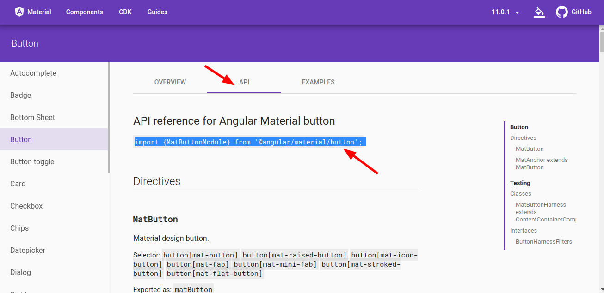
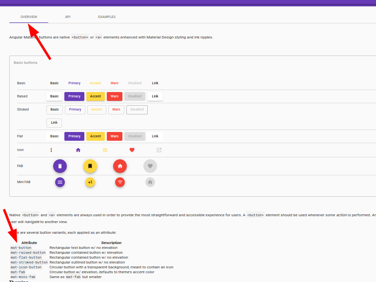

# Angular Material 101

<https://material.angular.io/>

Aprendiendo a utilizar los componentes de Angular Material para proyectos angular.

# Instalar

<https://material.angular.io/guide/getting-started>

```
ng add @angular/material

```

# Componentes

<https://material.angular.io/components/categories>

Cada modulo de material que nos interese nos digiremos a la seccion de API para importalos el modulo correspondiente de nuestra app



Luego en overview podremos ver los ejemplos para estilar los componentes



Como vemos hay muchos modulos de material por lo que es conveniente mantener las importaciones en un archivo separado **material.module.ts**

```
ng g m material
```

## Licencia 📄

MIT

## Conceptos Aprendidos 🤓

<https://www.youtube.com/watch?v=n5kTqHmLtN8&ab_channel=FaztCode>

---

👩‍💻 with ❤️ by [silnose](https://github.com/silnose) 😊
